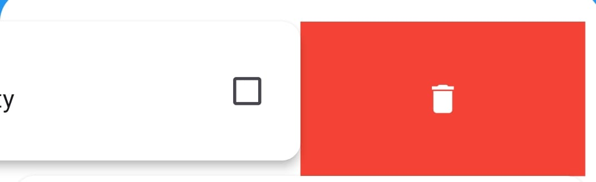
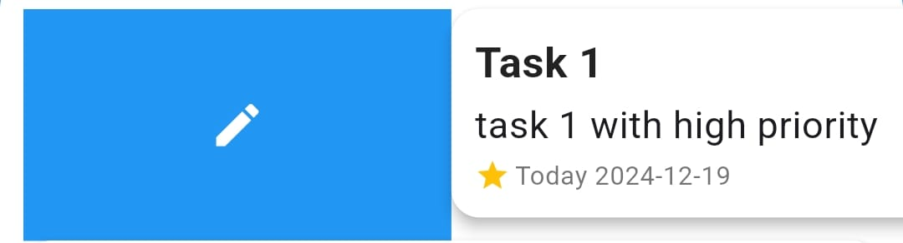
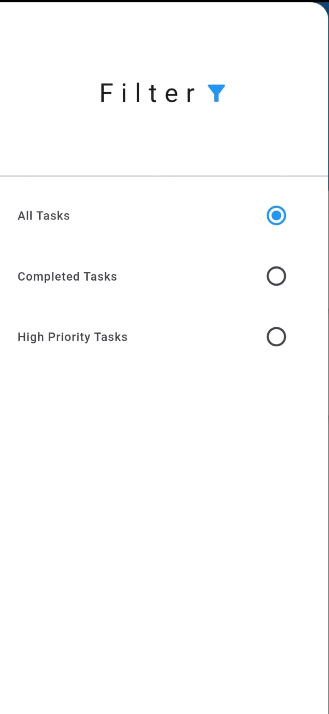

# Todo

A new Flutter project.

## Getting Started

This project is a starting point for a Flutter application.

A few resources to get you started if this is your first Flutter project:

- [Lab: Write your first Flutter app](https://docs.flutter.dev/get-started/codelab)
- [Cookbook: Useful Flutter samples](https://docs.flutter.dev/cookbook)

For help getting started with Flutter development, view the
[online documentation](https://docs.flutter.dev/), which offers tutorials,
samples, guidance on mobile development, and a full API reference.

## home Screen

<b>Home Screen</b> is the Starting point of our app  

click on the floating button to add task 

initially if there are no task in the screen , the app will add 2 dummy task to show difference between high priority and low priority task

  
 

## Add Task Screen

<b>Add task screen</b> is where you add task

you have to add all fields such as title, description, priority and due date 

if one  of the field is empty than it will show a snack bar or message showing all fields are required

## delete Task Screen

<b>Delete task button</b> is where you delete a task

if you want to delete a task swipe left on the task 

A bin button would be visible click on it and there you go task is deleted

## Edit Task Screen

<b>Edit task button</b> is where you edit a task

if you want to edit a task swipe right on the task 

A edit button would be visible click on it, you will be redirected to edit task screen similar to add task screen

if you are dont editing simply click on edit task button and your task will be edited

## Filter Task Screen

<b>Filter task Drawer</b> is where you filter all tasks

if you want to filter a task click on the menu button on top left of homescreen  

A drawer will be visible to you , initially the filter will be set on all task

you can filter a task based on high priority and if task is completed

