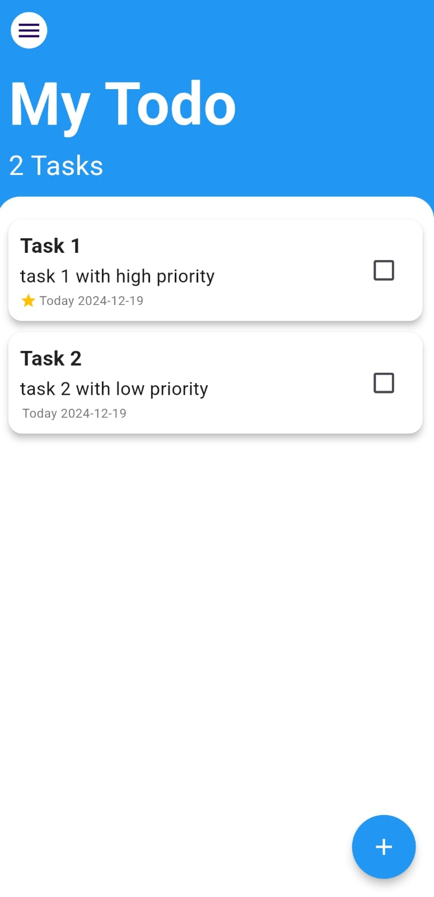
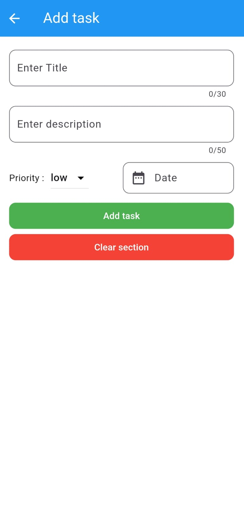

# my_todo

A new Flutter project.

## Getting Started

This project is a starting point for a Flutter application.

A few resources to get you started if this is your first Flutter project:

- [Lab: Write your first Flutter app](https://docs.flutter.dev/get-started/codelab)
- [Cookbook: Useful Flutter samples](https://docs.flutter.dev/cookbook)

For help getting started with Flutter development, view the
[online documentation](https://docs.flutter.dev/), which offers tutorials,
samples, guidance on mobile development, and a full API reference.

## Get started with app

## home Screen

  
  
<b>Home Screen</b> is the Starting point of our app 
   
  click on the floating button to add task 
   
  initially if there are no task in the screen , the app will add 2 dummy task to show difference between high priority and low priority task
  

## Add Task Screen

<b>Add task screen</b> is where you add task

you have to add all fields such as title, description, priority and due date 

if one  of the field is empty than it will show a snack bar or message showing all fields are required

